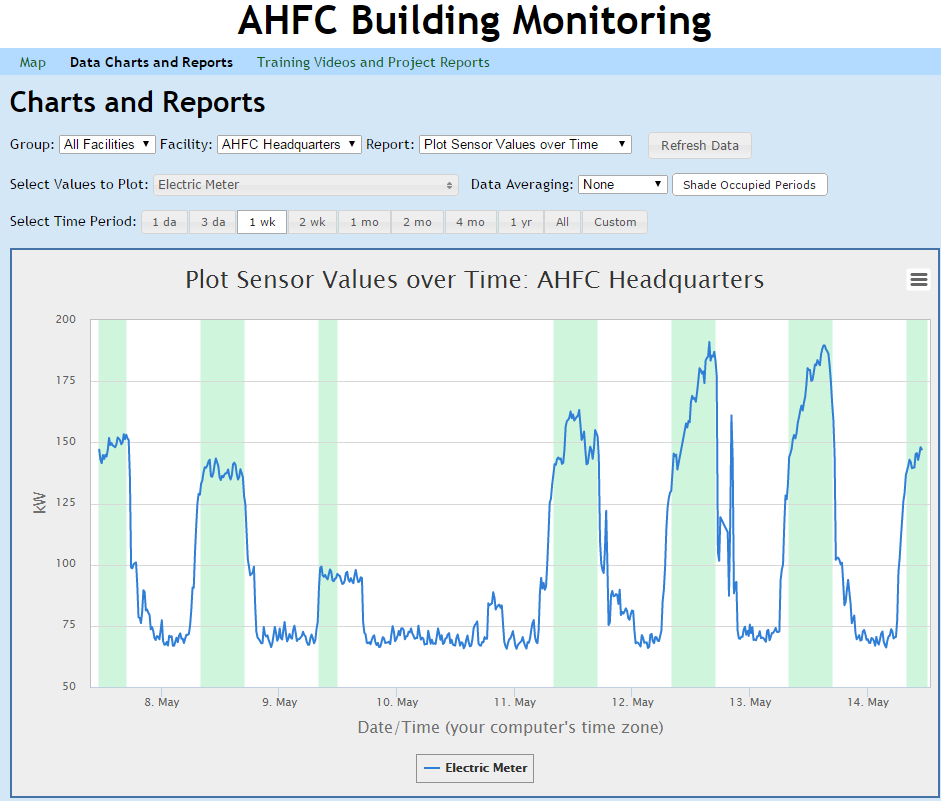

# BMON

##### Copyright (c) 2014, Alaska Housing Finance Corporation.  All Rights Reserved.

Licensed under the Apache License, Version 2.0 (the "License");
you may not use this software except in compliance with the License,
as described in the [LICENSE.md file](LICENSE.md).

BMON is a web-based software application built with the Python Django framework that stores and analyzes sensor data coming from buildings or other facilities. The application was developed by the Alaska Housing Finance Corporation (AHFC) to find ways to reduce the energy use and improve the maintenance of some of their buildings. The application presents a simple user interface for viewing data, but includes informative charts such as Histograms and Hourly Profile charts for analyzing the data. Alerts can be set up to text or email individuals if sensor values move outside normal ranges.

Here is a link to the [AHFC BMON Web Site](https://bms.ahfc.us/).  Here is a screenshot of the application being used to look at the electricicty usage of the AHFC Headquarters building (the green bands indicate the building's occupied periods):

Note that a major upgrade to Python 3.7 occurred on May 1, 2019.
Upgrade of existing systems running the Python 2.7 version will
require assistance from the developer, Alan Mitchell, alan@analysisnorth.com.
Please contact him before attempting an upgrade.

This version requires Python 3.7 or higher.  For an automated server install
script, see the [bmon-install project](https://github.com/alanmitchell/bmon-install).

For detailed information about this software: 

### Please see the [BMON Documentation](http://bmon-documentation.readthedocs.io/en/latest/index.html)
